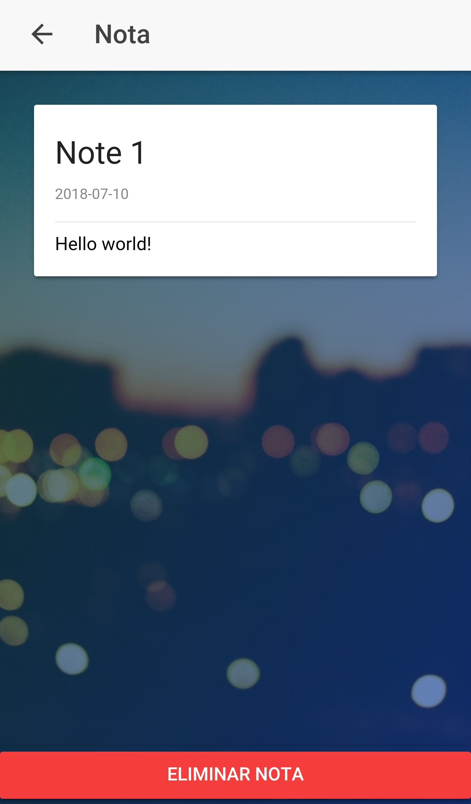

# Ionic Notes App  

## Ionic Info

```
CLI:

    @ionic/cli-utils  : 1.19.2
    ionic (Ionic CLI) : 3.20.0

global packages:

    cordova (Cordova CLI) : 8.0.0

local packages:

    @ionic/app-scripts : 3.1.10
    Cordova Platforms  : none
    Ionic Framework    : ionic-angular 3.9.2

System:

    Node : v8.11.3
    npm  : 6.1.0
    OS   : Windows 10
```

## Screenshots

<p align="center"> 



</p>
